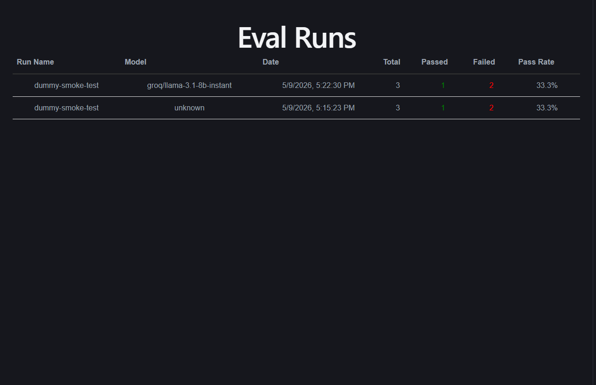

# Control Room
> Lightweight, self-hostable LLM regression and canary testing platform.

## What is Control Room? 

When you swap an LLM (say GPT-4o for Gemini 1.5 Pro) or change a prompt, you have no idea what broke until users hit it in production. Control Room lets developers run a golden dataset against their LLM pipeline, score outputs with an LLM-as-judge, and see exactly which test cases regressed — before shipping the change.

## How it works

1. Define a golden dataset
2. Run it against your LLM via the Python SDK
3. LLM-as-judge scores each output
4. Results stored and visible in the UI

## Quick Start

### 1. Install the SDK

```bash
# Clone the repo and install locally
git clone https://github.com/PiyushG1816/control-room.git
cd control-room/sdk
pip install -e .
```

### 2. Run your first eval

```python
from controlroom import Dataset, run_eval

dataset = Dataset([
    {"input": "What is the capital of France?", "expected": "Paris"},
    {"input": "What is 2 + 2?", "expected": "4"},
])

def my_llm(input: str) -> str:
    # user's own LLM call here
    return call_openai(input)

results = run_eval(dataset=dataset, llm=my_llm, run_name="gpt4o-baseline")
```

### 3. Start the backend

```bash
uvicorn main:app --reload
```

### 4. View results

Open http://localhost:5173

## Tech Stack

- SDK: Python + Pydantic + Groq
- Backend: FastAPI + PostgreSQL (Supabase)
- Frontend: React + Vite

## Project Structure

```
control-room/
├── sdk/
│   ├── controlroom/
│   │   ├── __init__.py
│   │   ├── dataset.py       # Dataset and TestCase definitions
│   │   ├── models.py        # Pydantic models (EvalResult, TestCaseResult)
│   │   ├── runner.py        # Runs test cases against user's LLM
│   │   ├── scorer.py        # LLM-as-judge scoring logic
│   │   └── client.py        # Sends results to backend API
│   ├── pyproject.toml
│   └── README.md
├── backend/
│   ├── main.py
│   ├── models.py            # SQLAlchemy models
│   ├── database.py          # DB connection
│   ├── routes/
│   │   ├── runs.py          # Eval run endpoints
│   │   └── results.py       # Test case result endpoints
│   └── requirements.txt
├── frontend/
│   ├── src/
│   │   ├── pages/
│   │   ├── components/
│   │   └── api/             # API calls to backend
│   └── vite.config.js
└── docs/
```

## Roadmap

- v0.1: Core eval loop + UI (complete)
- v0.2: Model A vs Model B canary comparison
- v0.3: Judge calibration pipeline
- v0.4: Docker self-hosting
- v1.0: PyPI release

## License

MIT
